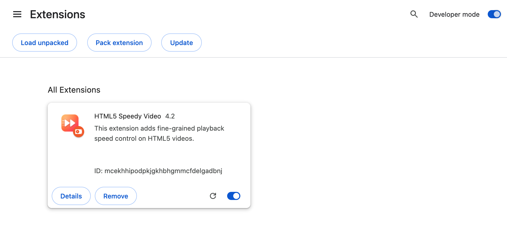

<h1 align="center">🎬 Speedy Video</h1>

<p align="center"><b>⚡ Freshly rebuilt in 2026 — version 4.6 ⚡</b><br>
Manifest V3 · Chrome &amp; Safari · one-command install</p>

<p align="center">
  
  
  
  <a href="https://github.com/ricardobcl/Speedy-Video-Extension/actions/workflows/ci.yml"></a>
  
</p>

A tiny browser extension for fine-grained control over the playback speed of
HTML5 videos on Youtube (Shorts included), Netflix, Instagram, X, Patreon, WhatsApp
or any other website you turn it on for: keyboard shortcuts, plus an overlay that
shows the speed whenever it changes — and that overlay is the only thing it adds
to the page.

It is a small [Manifest V3](https://developer.chrome.com/docs/extensions/develop/migrate)
extension: no network access, and access only to the websites you turn it on
for, which it asks for one site at a time (or all at once, if you prefer).
Local installation only, for now.
Last tested on Youtube with Chrome 152 and Safari 26.6.

## 🆕 What's new in 4.x (2026)

**4.6**

- ⚙️ **An options page** — change every shortcut, the speed step (e.g. 0.2x instead of 0.25x), the slowest and fastest speeds, the presets and the seek amounts, without editing the code; changes apply to open tabs right away

**4.5**

- 🎯 **Speeds stay on the step** — after bottoming out at 0.2x, `w` now goes to 0.25x instead of 0.45x, 0.7x, 0.95x…
- ⌨️ **Typing is safe in more text fields** — keys typed in fields built as web components (inside shadow DOM) no longer change the speed
- ⚡ **Lighter after a video goes away** — e.g. closing WhatsApp's video viewer no longer leaves it scanning the page every second

**4.4**

- 🏷️ **A new name** — *HTML5 Speedy Video* is now just *Speedy Video*: every video on the web is HTML5 these days

**4.3**

- 🌐 **Four more websites** — NOS TV, Disney+, HBO Max and Prime Video
- ⚡ **Lighter on every page** — it no longer polls the page looking for a video, so a Youtube video costs no full-DOM scans at all (it did one a second), and a tab with no video one instead of 150
- ⌨️ **Shortcuts are always installed** — they used to wait for a video to be found, so a video that showed up late could leave them missing
- 🎨 **A new icon**

**4.0** — the 2018 version stopped loading years ago: Manifest V2 is gone from
Chrome and the old extension format is gone from Safari. 4.0 is a rebuild:

- ✅ **Works again** — Manifest V3, tested on Chrome 152
- 🧭 **Safari support** — as a signed Safari Web Extension (`make safari`)
- ⌨️ **New shortcuts** — `w`/`q` for ±0.25x, `a`/`s`/`d` for 1x/2x/3x, `z` shows the speed
- 👀 **Speed overlay** — on the video whenever the speed changes, also in fullscreen
- 🌐 **More websites** — Youtube Shorts, Instagram (feed, reels and stories), X, Patreon, WhatsApp and Youtube embeds anywhere
- 🎯 **Follows the playing video** — feeds, reels, stories and Shorts just work
- 🧹 **Nothing else on the page** — the old ☜ 1x ☞ buttons on the player bar are gone
- 🐛 **Fixes** — no more runaway polling, leaked timers or speeds Chrome refuses
- 🚀 **One-command install** — `make install` for Chrome, `make safari` for Safari

### Youtube


### Youtube Shorts


## 🚀 Install in Chrome

**Without a terminal** — [download the ZIP of this repo](https://github.com/ricardobcl/Speedy-Video-Extension/archive/refs/heads/master.zip)
and unzip it (the extension comes pre-built). Then:

1. Go to [chrome://extensions](chrome://extensions) and turn on **Developer mode** (top right corner)
2. Click **Load unpacked** and choose the `chrome` folder

Done — its options page opens: turn on the usual video sites there, or open
a video site and turn it on from the extension's toolbar icon (see
[Sites](#sites)).

**With git** (easier to update later):

```Shell
git clone https://github.com/ricardobcl/Speedy-Video-Extension.git
cd Speedy-Video-Extension
make install
```

`make install` builds the extension, highlights the folder in Finder and opens
`chrome://extensions` in Chrome for you — just turn on **Developer mode** and
click **Load unpacked** with the highlighted folder.



**Updating**: `git pull && make` (or re-download the ZIP), then click the
reload icon on the extension's card in `chrome://extensions`.

## 🧭 Install in Safari

Safari requires extensions to be wrapped in a Mac app (a
[Safari Web Extension](https://developer.apple.com/documentation/safariservices/safari-web-extensions)),
so you need [Xcode](https://apps.apple.com/app/xcode/id497799835) installed
(free, but big; the CLI tool [xcodes](https://github.com/XcodesOrg/xcodes)
can download it too). Then:

1. Add your Apple ID in Xcode → Settings → Accounts → **+** (a free account
   is enough; it shows up as your "Personal Team"). This lets `make safari`
   sign the extension, so Safari keeps it enabled across restarts.
2. Run:

   ```Shell
   make safari
   ```

   This converts the Chrome extension into a Safari Web Extension Xcode
   project (in the git-ignored `safari/` folder), signs and builds the small
   wrapper app and opens it, which registers the extension with Safari.
3. In Safari → Settings → Extensions, turn on **Speedy Video**
4. Open a video site, click the extension's icon in the toolbar and turn it on
   for the site (see [Sites](#sites)); Safari asks you to confirm

**NOTES**:

- **Updating**: run `make safari` again.
- `make safari` picks the first personal team of the Apple IDs in Xcode; use
  `make safari TEAM_ID=XXXXXXXXXX` to choose another one.
- Without an Apple ID in Xcode the app is ad-hoc signed and Safari only loads
  it while **Allow unsigned extensions** is on (Settings → Advanced → Show
  features for web developers, then Settings → Developer). That setting
  resets every time Safari quits, so signing is worth the one-time setup.
- Publishing the extension (App Store or notarized) would additionally
  require the paid Apple Developer Program.
- It needs Safari 26 or later: older versions ignore the list of sites turned
  off while all sites are on.
- Safari has its own say on which websites an extension may access: choosing
  **Always Allow on Every Website** in Safari's prompt also turns Speedy Video
  on for all sites, and turning all sites off in Speedy Video also turns off
  the sites you had turned on one by one. Settings are not synced across
  devices in Safari.

<a id="sites"></a>

## 🌐 Sites

Speedy Video only runs on the sites you turn it on for. On a video site, click
its icon in the toolbar and choose **Turn on for youtube.com** (or **Turn on
for all sites**); the browser asks you to confirm, and it starts working in
the open tabs right away, no reload needed. The same popup turns it off again.

- A site includes its subdomains: turning on `youtube.com` also covers
  `music.youtube.com`.
- With **all sites** on, you can still turn it off on single sites; the
  popup turns them back on.
- The options page lists the sites it runs on (and the ones turned off), with
  buttons to remove them, to turn on all sites, or to turn on the usual video
  sites in one go: Youtube, Netflix, Disney+, HBO Max, Prime Video, Instagram,
  X, Patreon, WhatsApp and NOS TV.

These are the sites it has been tried on:

| Website        | Notes                                                              |
| -------------- | ------------------------------------------------------------------ |
| Youtube        | regular videos and Shorts                                          |
| Netflix        | the seek shortcuts are left to Netflix's own                       |
| NOS TV         | `nostv.pt` (live TV and on-demand)                                 |
| Disney+        | `disneyplus.com`                                                   |
| HBO Max        | `hbomax.com`, including the `play.hbomax.com` player               |
| Prime Video    | `primevideo.com`                                                   |
| Instagram      | feed, reels and stories                                            |
| X              | `x.com` and `twitter.com`                                          |
| Patreon        | Patreon's own player and embedded Youtube videos                   |
| WhatsApp       | videos opened in the viewer of `web.whatsapp.com`                  |
| Youtube embeds | on any website, once `youtube.com` and `youtube-nocookie.com` are on (the usual video sites include both): click the embedded player first, so it has focus |

It works on any HTML5 `<video>`, also inside shadow DOM: it controls the video
that is playing (the largest one, if several are), so it follows you through
feeds, reels, stories and Shorts, and keeps the speed you chose across videos
until you change it (and across pages too, if you have it remember the speed). Videos that show up later, e.g. opened in a viewer, are
picked up when they start playing. It also runs inside frames, which is how
embedded Youtube players work.

## ⌨️ Keyboard Shortcuts

| Key                   | Action                              |
| --------------------- | ----------------------------------- |
| `w`                   | Speed up by 0.25x                   |
| `q`                   | Slow down by 0.25x                  |
| `a`                   | Set speed to 1x                     |
| `s`                   | Set speed to 2x                     |
| `d`                   | Set speed to 3x                     |
| `z`                   | Show the current speed on the video |
| shift + :arrow_left:  | \*\* Rewind 2 seconds               |
| shift + :arrow_right: | \*\* Skip 2 seconds                 |
| shift + :arrow_down:  | \*\* Rewind 10 seconds              |
| shift + :arrow_up:    | \*\* Skip 10 seconds                |

These are the defaults; every key and amount can be changed on the options
page (see [Options](#options) below). Whenever the speed changes the new speed
is shown for a second in an overlay near the top of the video, also in
fullscreen. Press `z` to show it at any time.

Notes:

- The speed is kept between the slowest and fastest speeds (0.2x to 4x by
  default), and `w`/`q` step to the next multiple of the step (0.25x by
  default).
- Shortcuts are ignored while you are typing in a text field, so they don't
  interfere with searching or commenting, and modifier combos like
  control + `a` are never stolen.
- The letter keys are only taken while a video is on screen; with none (e.g.
  a chat with its video viewer closed) they reach the website as usual.

\*\* Not on Netflix, although they do skip and rewind by default anyway, just
not these amounts.

<a id="options"></a>

## ⚙️ Options

The options page changes the sites, shortcuts and speeds; changes are saved
right away and apply to open tabs too, no reload needed. Open it by right-clicking
the extension's toolbar icon → **Options**, or from its card in
`chrome://extensions` → **Details** → **Extension options**. In Safari:
Settings → Extensions → Speedy Video → **Settings**.

- **Sites**: the sites it runs on (see [Sites](#sites))
- **Speed**: whether to remember the speed (for each site, or one for all
  sites: new pages start at it, and changing it in one tab changes it in the
  others), the step for speeding up and slowing down (0.05x to 1x), and the
  slowest and fastest speeds
- **Shortcuts**: the speed up, slow down and show-the-speed keys, and the
  speed presets (add, remove or change a key and its speed). Single keys
  only, without shift (that is for seeking) or other modifiers; a key that is
  already taken is refused
- **Seeking**: how far shift + the arrow keys jump
- **Speed overlay**: how long the speed stays on the video

Settings are kept in the browser's synced extension storage, so they follow
your Chrome profile. The defaults live in `src/settings.js`.

## 🛠️ Development

The source lives in `src/`; `make` copies it into the Chrome extension
folder, which is committed so that the ZIP download comes pre-built. The
Safari Xcode project is generated from the Chrome folder, so it always picks
up the latest build.

- `speedy.js` — the content script: shortcuts, overlay, keeping the speed
  (`make` joins `sites.js`, `settings.js` and it into `content.js`, the
  file that runs in pages)
- `settings.js` — the settings and their defaults
- `sites.js` — which sites it runs on (the granted permissions, minus the
  sites turned off)
- `background.js` — registers the content script for those sites and starts
  or stops it in open tabs when they change
- `popup.*` and `options.*` — the toolbar popup and the options page

```Shell
> npm install   # once, installs ESLint
> npm run lint  # lints src/
> make          # builds the Chrome extension folder
> make install  # builds and walks you through loading it in Chrome
> make safari   # converts it into a Safari Xcode project (requires Xcode)
```

CI runs the lint on every push and fails if the committed build is out of
date with `src/` (fix with `make` + commit).

## 📝 Disclaimer

This is intended to be a fun personal project, both to train Javascript and to be useful in my daily life (I love to speed-up videos).
This is not a commercial product and thus support is not available.

## 📄 License

[MIT license](LICENSE)
